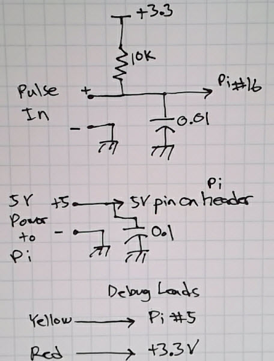

# pi-energy-sensors
Implements energy-related sensors on the Raspberry Pi, including a BTU meter and a Pulse Counter.

These scripts assume that you have installed the [Mini-Monitor](../mini-monitor) software on the
Pi, as these scripts use the Settings file from that application and other resources including
the MQTT broker.  A downloadable SD Card image file is available in the Software portion of that
project's Wiki.

Note that frequency limit for the pulse inputs on both the Pulse Counter and the BTU Meter is
about 10 Hz, assuming a square wave.  For aysmettrical pulses, the shorter portion of 
the pulse should be at least 50 millseconds long. This criteria accounts for some delays that 
occur in the Raspberry Pi sampling of the pulse input due to the Pi OS not being a real-time OS.

For the Pulse counter, the main script is `pulse_counter_1ch.py`, and the supervisor script that
starts and restarts the pulse counter script is `run_pulse_counter_1ch`.
Here are the schematic and board picture for the Pulse Counter:

For the BTU meter, the main script is `btu_meter.py` and the supervisor script to start
and restart it is `run_btu_meter`.  Here are the schematic and board picture for the BTU meter:

